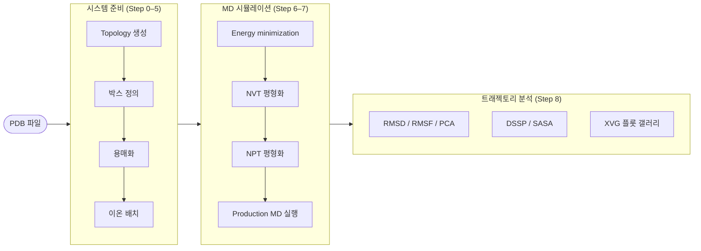

# GROMACS Web UI

PDB 파일 업로드 한 번으로 GROMACS 분자동역학(MD) 시뮬레이션을 브라우저에서 완전 제어하는 웹 하네스.  
LLM(Claude / Codex / Gemini)이 입력 데이터와 튜토리얼 문서를 기반으로 각 Step을 순서대로 따라가며 실행하거나, 직접 단계별 제어도 지원합니다.

---

## Features

### MD 시뮬레이션 파이프라인



### 실행 모드

- **직접 제어** — 각 Stage 완료 후 사용자가 **Continue** / **Abort** 로 진행 여부 결정
- **LLM 튜토리얼 실행** — LLM 에이전트가 입력 데이터와 튜토리얼 문서를 기반으로 각 Step을 순서대로 따라가며 실행하고, 도구 승인 요청 발생 시 Y/N 팝업으로 처리
- **System Builder** — 런 시작 전 MD 시스템 파라미터를 설정하는 6단계 마법사. 설정을 프리셋으로 저장·재사용하고, LLM 프롬프트에 강제 제약으로 주입

### System Builder

```
Step 1 → Step 2 → Step 3 → Step 4 → [Step 5]  → Step 6
PDB       Force    박스      이온     시뮬레이션  검토 &
업로드    Field             설정     (Expert)    시작
```

마법사가 생성한 `system_config.json`을 LLM이 반드시 따라야 하는 설정으로 주입합니다. Force field, Water model, Box 형태·크기, 이온 종류·농도를 기본 파라미터로 설정하며, Expert 모드에서는 온도, 압력, 시뮬레이션 시간, Thermostat, Barostat까지 제어할 수 있습니다. 설정을 프리셋으로 저장해 다음 런에서 바로 불러올 수 있으며, 런 완료 후 `/api/runs/{id}/audit` 엔드포인트에서 LLM이 Builder 설정을 실제로 준수했는지 확인할 수 있습니다.

### 지원 LLM

Claude Code, OpenAI Codex CLI, Gemini CLI를 지원합니다. 각 LLM은 PTY 프로세스로 실행되며, WebSocket + xterm.js 터미널을 통해 출력이 브라우저에 실시간 스트리밍됩니다.

---

## 지원 튜토리얼

| 튜토리얼                           | 시스템                                 |
| ---------------------------------- | -------------------------------------- |
| Lysozyme in Water                  | 수용액 중 구형 단백질                  |
| KALP15 in DPPC                     | 지질 이중층 내 막관통 펩타이드         |
| Protein-Ligand Complex             | 단백질-소분자 결합 시스템              |
| Umbrella Sampling                  | 평균력 포텐셜(PMF) / 자유에너지 샘플링 |
| Building Biphasic Systems          | 소수성/수성 이상계 계면                |
| Free Energy of Hydration (Methane) | 연금술적 자유에너지 섭동               |
| Free Energy of Hydration (Ethanol) | 연금술적 자유에너지 섭동 (CGenFF)      |
| Virtual Sites                      | 가상 상호작용 사이트를 통한 강체 구속  |

---

## Installation

### 필수 항목

| 항목               | 필요한 기능                                                                                               |
| ------------------ | --------------------------------------------------------------------------------------------------------- |
| Python 3.13        | 웹 서버 런타임 (FastAPI + uvicorn)                                                                        |
| GROMACS 2026.0     | 파이프라인 전 단계 — Topology / 용매화 / 평형화 / Production run / 분석                                   |
| `requirements.txt` | REST API · WebSocket 서버 + 트래젝토리 분석 플롯 (`fastapi`, `uvicorn`, `python-multipart`, `matplotlib`) |

### 선택 항목

| 항목            | 필요한 기능                       |
| --------------- | --------------------------------- |
| PyMOL           | 단백질 구조 시각화                |
| VMD             | 단백질 구조 / 트래젝토리 시각화   |
| ffmpeg          | 트래젝토리 애니메이션 렌더링      |
| Claude Code CLI | LLM 튜토리얼 실행 — Claude        |
| Codex CLI       | LLM 튜토리얼 실행 — OpenAI Codex  |
| Gemini CLI      | LLM 튜토리얼 실행 — Google Gemini |

---

### Linux

```bash
# 1. Miniforge 설치 (conda가 없는 경우)
#    설치 스크립트 다운로드 후 실행: https://github.com/conda-forge/miniforge

# 2. conda 환경 생성 (Python 3.13 + GROMACS)
conda create -n gromacs_web -c conda-forge gromacs python=3.13 -y
conda activate gromacs_web

# 3. 저장소 클론 및 Python 의존성 설치
git clone https://github.com/DDUKHAE/Gromacs_WEB_UI.git
cd Gromacs_WEB_UI
pip install -r requirements.txt

# 4. 설치 확인
gmx --version
python scripts/check_gromacs_env.py   # GROMACS + 선택 도구 전체 진단 (JSON 출력)

# ── 선택 항목 ────────────────────────────────────────────────────────────
# ffmpeg (트래젝토리 애니메이션)
sudo apt install ffmpeg

# PyMOL (구조 시각화 — 오픈소스 빌드)
conda install -c conda-forge pymol-open-source
# VMD (구조/트래젝토리 시각화): https://www.ks.uiuc.edu/Research/vmd/

# LLM CLI (튜토리얼 실행 모드) — Node.js 필요
npm install -g @anthropic-ai/claude-code    # Claude Code
npm install -g @openai/codex                # Codex CLI  (https://github.com/openai/codex)
npm install -g @google/gemini-cli           # Gemini CLI (https://github.com/google-gemini/gemini-cli)
# ─────────────────────────────────────────────────────────────────────────

# 5. 서버 실행 → 브라우저 자동 오픈 (http://localhost:8000)
python main.py
```

---

### macOS

```bash
# 1. Miniforge 설치 (conda가 없는 경우)
#    설치 스크립트 다운로드 후 실행: https://github.com/conda-forge/miniforge

# 2. conda 환경 생성 (Python 3.13 + GROMACS)
conda create -n gromacs_web -c conda-forge gromacs python=3.13 -y
conda activate gromacs_web

# 3. 저장소 클론 및 Python 의존성 설치
git clone https://github.com/DDUKHAE/Gromacs_WEB_UI.git
cd Gromacs_WEB_UI
pip install -r requirements.txt

# 4. 설치 확인
gmx --version
python scripts/check_gromacs_env.py

# ── 선택 항목 ────────────────────────────────────────────────────────────
# ffmpeg (트래젝토리 애니메이션)
brew install ffmpeg

# PyMOL (구조 시각화 — 오픈소스 빌드)
conda install -c conda-forge pymol-open-source
# VMD (구조/트래젝토리 시각화): https://www.ks.uiuc.edu/Research/vmd/

# LLM CLI (튜토리얼 실행 모드) — Node.js 필요
npm install -g @anthropic-ai/claude-code    # Claude Code
npm install -g @openai/codex                # Codex CLI  (https://github.com/openai/codex)
npm install -g @google/gemini-cli           # Gemini CLI (https://github.com/google-gemini/gemini-cli)
# ─────────────────────────────────────────────────────────────────────────

# 5. 서버 실행 → 브라우저 자동 오픈 (http://localhost:8000)
python main.py
```

---

### Windows

WSL2 (Ubuntu) 설치를 권장합니다. WSL 터미널을 열고 Linux 방법을 따릅니다.

네이티브 Windows에서 실행하려면 [Miniforge Windows 인스톨러](https://github.com/conda-forge/miniforge)를 설치한 뒤 Anaconda Prompt에서 아래 명령을 실행합니다.

```bash
# 1. conda 환경 생성 (Python 3.13 + GROMACS)
conda create -n gromacs_web -c conda-forge gromacs python=3.13 -y
conda activate gromacs_web

# 2. 저장소 클론 및 Python 의존성 설치
git clone https://github.com/DDUKHAE/Gromacs_WEB_UI.git
cd Gromacs_WEB_UI
pip install -r requirements.txt

# 3. 설치 확인
gmx --version
python scripts/check_gromacs_env.py

# ── 선택 항목 ────────────────────────────────────────────────────────────
# ffmpeg (트래젝토리 애니메이션): https://ffmpeg.org/download.html 에서 다운로드 후 PATH 추가

# PyMOL (구조 시각화 — 오픈소스 빌드)
conda install -c conda-forge pymol-open-source
# VMD (구조/트래젝토리 시각화): https://www.ks.uiuc.edu/Research/vmd/

# LLM CLI (튜토리얼 실행 모드) — Node.js 필요
npm install -g @anthropic-ai/claude-code    # Claude Code
npm install -g @openai/codex                # Codex CLI  (https://github.com/openai/codex)
npm install -g @google/gemini-cli           # Gemini CLI (https://github.com/google-gemini/gemini-cli)
# ─────────────────────────────────────────────────────────────────────────

# 4. 서버 실행 → 브라우저 자동 오픈 (http://localhost:8000)
python main.py
```

서버 실행 옵션:

```bash
python main.py --port 8080   # 포트 변경
python main.py --listen      # 0.0.0.0 바인딩 (같은 네트워크의 다른 기기에서 접속)
python main.py --no-browser  # 브라우저 자동 오픈 비활성화
```

---

## Force Field 안내

각 튜토리얼은 원본(mdtutorials.com) 기준의 force field를 그대로 사용합니다.

### GROMACS에 기본 포함된 Force Field

`conda-forge::gromacs` 설치 시 아래 force field가 `$GMXLIB`에 자동 포함됩니다.

| Force Field      | 해당 튜토리얼                                         |
| ---------------- | ----------------------------------------------------- |
| `oplsaa`         | Lysozyme (대체), Free Energy (Methane), Virtual Sites |
| `gromos53a6`     | Umbrella Sampling, KALP15 in DPPC                     |
| `gromos43a1`     | Building Biphasic Systems                             |
| `amber99sb-ildn` | —                                                     |
| `charmm27`       | —                                                     |

### 별도 설치 필요: CHARMM36

CHARMM36은 GROMACS 패키지에 포함되지 않으며, 아래 튜토리얼에서 요구합니다.

| 튜토리얼                   | 이유                                         |
| -------------------------- | -------------------------------------------- |
| **Lysozyme in Water**      | Justin Lemkul 최신 튜토리얼 기준 force field |
| **Protein-Ligand Complex** | CGenFF 소분자 파라미터와의 일관성 유지       |
| **Free Energy (Ethanol)**  | CHARMM General Force Field (CGenFF) 사용     |

MacKerell 연구실 공식 배포 페이지에서 "CHARMM36 force field for GROMACS" 항목을 다운로드하세요:  
https://mackerell.umaryland.edu/charmm_ff.shtml

---

## 사용 방법

### 새 시뮬레이션 시작 (System Builder 마법사)

1. **New Run** 클릭 → 6단계 System Builder 마법사 열림
2. **Step 1** — PDB 파일 업로드 (드래그&드롭 또는 클릭). **Expert Mode** 토글 시 Step 5 (시뮬레이션 파라미터) 활성화
3. **Step 2** — Force field / Water model 선택
4. **Step 3** — Box 형태와 Edge distance 설정
5. **Step 4** — Salt 종류 및 이온 농도 설정
6. **Step 5** *(Expert 전용)* — 온도, 압력, 시뮬레이션 시간, Thermostat, Barostat 설정
7. **Step 6** — 전체 설정 검토, 프리셋 저장(선택), LLM 선택 후 **Start** 클릭

### LLM 튜토리얼 실행 모드

- LLM 에이전트가 입력 데이터와 튜토리얼 문서를 기반으로 각 Step을 순서대로 따라가며 실행
- 도구 승인 요청 발생 시 Permission 다이얼로그 자동 팝업 → Y/N 응답
- 내장 xterm.js 터미널에서 에이전트 출력 실시간 확인

### 직접 제어 모드

- `env-builder` 완료 후 **Continue** → `md-runner` 시작
- `md-runner` 완료 후 **Continue** → `illustrator` 시작
- 언제든 **Abort** 로 파이프라인 중단 가능

### 결과 확인

파이프라인 완료 후 **Results Gallery** 패널에서 XVG 출력 파일로부터 파싱된 RMSD, RMSF, 에너지 플롯 확인

---

## 디렉터리 구조

```
.
├── main.py                    서버 진입점 (uvicorn 래퍼)
├── pyproject.toml             Python 패키지 설정
├── requirements.txt           Python 의존성
├── AGENTS.md                  LLM 운영 규칙 + skill 자원 매핑
├── ARCHITECTURE.md            Step 0–8 계약, 3-skill 매핑
│
├── web/                       FastAPI 웹 서버
│   ├── server.py              REST API + WebSocket 엔드포인트
│   ├── llm_runner.py          PTY 기반 LLM 프로세스 관리
│   ├── runner.py              직접 실행 subprocess 래퍼
│   ├── run_reader.py          실행 상태 파일 파서
│   ├── llm_adapters/          Claude / Codex / Gemini CLI 어댑터
│   └── static/
│       ├── index.html         단일 페이지 프론트엔드 (vanilla JS)
│       ├── xterm.js           터미널 에뮬레이터
│       └── xterm-addon-fit.js 터미널 자동 크기 조정 애드온
│
├── skills/                    3단계 파이프라인 스킬
│   ├── env_builder/           Step 0–5: topology / box / solvate / ions
│   ├── md_runner/             Step 6–7: grompp + mdrun, retry 처리
│   └── illustrator/           Step 8: RMSD/RMSF/PCA + 플롯 + 리포트
│
├── lib/                       내부 공용 라이브러리
│   ├── system_config.py       System Builder — 설정 검증 + LLM 제약 프롬프트 생성
│   ├── system_config_validator.py  런 완료 후 감사: Builder 설정 vs LLM 실제 사용값 비교
│   ├── xvg_parser.py          XVG 파일 파서 (분석 갤러리 백엔드)
│   ├── state.py               workspace/state.json 입출력
│   ├── validators.py          Step별 검증 게이트
│   ├── gmx_wrapper.py         GROMACS 명령 래퍼
│   ├── tutorial_registry.py   튜토리얼 라우팅 로직
│   └── mdp_templates/         MDP 파라미터 템플릿
│
├── presets/                   저장된 System Builder 프리셋 (사용자 생성, gitignore)
├── tutorial_data/             8개 튜토리얼 표준 입력 파일 (PDB/GRO/TOP)
│
├── scripts/
│   ├── check_gromacs_env.py   의존성 진단 — GROMACS + 선택 도구 (JSON 출력)
│   └── regression/            튜토리얼별 회귀 테스트 스크립트
│
└── docs/
    ├── STATE_SCHEMA.md        workspace/state.json 공식 스키마
    ├── pipeline_contract.md   Step별 입출력/안전 계약
    ├── WARNING_FLOW.md        사용자 결정형 WARNING 분기 로직
    ├── runbook.md             수동 복구 절차
    └── tutorial/
        ├── tutorial_index.json         전체 매니페스트 레지스트리
        └── <튜토리얼>/tutorial.manifest.json  튜토리얼별 매니페스트 + 단계 문서
```

---

## Tutorial Manifest 시스템

각 튜토리얼은 **매니페스트**(`tutorial.manifest.json`)로 정의됩니다. 매니페스트는 force field 기본값, 시뮬레이션 박스 파라미터, 활성 파이프라인 단계, Step별 문서 참조를 선언하는 라우팅 계약입니다.

```jsonc
{
  "id": "Lysozyme_in_water",
  "pipeline_variant": "protein_aqueous_standard",
  "required_inputs": ["protein_pdb"],
  "defaults": { "forcefield": "charmm36", "water_model": "tip3p", "box_type": "cubic" },
  "architecture_steps": [0, 1, 2, 3, 4, 5, 6, 7, 8],
  "documents": { "step_1": "generate_topology/prepare_the_topology.md", ... },
  "validation_profile": "standard_protein_water"
}
```

기본 8개 매니페스트는 저장소에 포함되어 별도 설치가 필요 없습니다. 모든 매니페스트는 `docs/tutorial/tutorial_index.json` 레지스트리에 등록되며, `lib/tutorial_registry.py`가 이를 읽어 입력 PDB/프롬프트에 맞는 튜토리얼로 라우팅합니다.

### 새 매니페스트 등록 방법

```bash
# 1. 튜토리얼 디렉터리 + 매니페스트 파일 생성
#    기존 매니페스트를 docs/tutorial/<NewTutorial>/tutorial.manifest.json 으로 복사해 수정

# 2. Step별 가이드 문서 배치 (manifest의 "documents" 경로와 일치해야 함)
#    예: docs/tutorial/<NewTutorial>/generate_topology/...md

# 3. docs/tutorial/tutorial_index.json 의 "entries" 배열에 항목 추가
#    { "id": "...", "manifest_path": "...", "required_inputs": [...], ... }

# 4. (선택) lib/tutorial_registry.py 의 KEYWORDS 딕셔너리에 키워드 라우팅 추가

# 5. 등록 확인
python -c "from lib.tutorial_registry import load_manifest; print(load_manifest('<NewTutorial>'))"
```

> `tutorial_index.json`에 등록되지 않은 매니페스트는 하네스가 인식하지 못합니다. 레지스트리 등록이 곧 "설치"입니다.

---

## 문서

| 문서                                                                         | 용도                               |
| ---------------------------------------------------------------------------- | ---------------------------------- |
| [`AGENTS.md`](AGENTS.md)                                                     | LLM 운영 규칙 + skill 자원 매핑    |
| [`ARCHITECTURE.md`](ARCHITECTURE.md)                                         | Step 0–8 계약, 3-skill 매핑        |
| [`docs/STATE_SCHEMA.md`](docs/STATE_SCHEMA.md)                               | `workspace/state.json` 공식 스키마 |
| [`docs/pipeline_contract.md`](docs/pipeline_contract.md)                     | Step별 입출력/안전 계약            |
| [`docs/WARNING_FLOW.md`](docs/WARNING_FLOW.md)                               | 사용자 결정형 WARNING 분기 로직    |
| [`docs/runbook.md`](docs/runbook.md)                                         | 수동 복구 절차                     |
| [`docs/tutorial/LLM_TUTORIAL_GUIDE.md`](docs/tutorial/LLM_TUTORIAL_GUIDE.md) | 튜토리얼 라우팅 결정 트리          |
| [`TESTING_WITH_TUTORIAL_DATA.md`](TESTING_WITH_TUTORIAL_DATA.md)             | 튜토리얼 데이터 회귀 테스트 가이드 |

---

## License

MIT — [`LICENSE`](LICENSE) 참조.

GROMACS 자체는 LGPL-2.1로 별도 배포되며, 이 저장소는 GROMACS를 외부 바이너리로 호출만 합니다.
