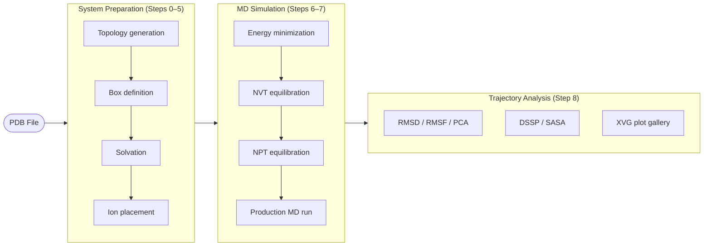

# GROMACS Web UI

A browser-based harness for running GROMACS molecular dynamics (MD) simulations from a single PDB file upload.
Supports LLM-guided tutorial execution (Claude, Codex, or Gemini) that follows the tutorial protocol step by step based on the input data, or manual stage-by-stage control.

---

## Features

### MD Simulation Pipeline



- **LLM-guided** — An LLM agent follows the tutorial protocol step by step, driven by the input data and bundled tutorial documentation; tool-approval requests surface as Y/N dialogs

### Supported LLMs

Claude Code, OpenAI Codex CLI, and Gemini CLI are supported. Each is spawned as a PTY process and streams output to the browser via WebSocket + xterm.js terminal.

---

## Supported Tutorials

| Tutorial                           | System                                         |
| ---------------------------------- | ---------------------------------------------- |
| Lysozyme in Water                  | Globular protein in aqueous solvent            |
| KALP15 in DPPC                     | Transmembrane peptide in a lipid bilayer       |
| Protein-Ligand Complex             | Protein–small molecule binding system          |
| Umbrella Sampling                  | Potential of mean force / free-energy sampling |
| Building Biphasic Systems          | Hydrophobic/aqueous two-phase interface        |
| Free Energy of Hydration (Methane) | Alchemical free-energy perturbation            |
| Free Energy of Hydration (Ethanol) | Alchemical free-energy perturbation (CGenFF)   |
| Virtual Sites                      | Rigid constraint via virtual interaction sites |

---

## Installation

### Required

| Dependency         | Purpose                                                                                                          |
| ------------------ | ---------------------------------------------------------------------------------------------------------------- |
| Python 3.13        | Web server runtime (FastAPI + uvicorn)                                                                           |
| GROMACS 2021+      | All pipeline stages — topology, solvation, equilibration, production run, analysis                               |
| `requirements.txt` | REST API · WebSocket server + trajectory analysis plots (`fastapi`, `uvicorn`, `python-multipart`, `matplotlib`) |

### Optional

| Dependency      | Purpose                                      |
| --------------- | -------------------------------------------- |
| PyMOL           | Protein structure visualization              |
| VMD             | Protein structure / trajectory visualization |
| ffmpeg          | Trajectory animation rendering               |
| Claude Code CLI | LLM-orchestrated execution — Claude          |
| Codex CLI       | LLM-orchestrated execution — OpenAI Codex    |
| Gemini CLI      | LLM-orchestrated execution — Google Gemini   |

---

### Linux

```bash
# 1. Install Miniforge (skip if conda is already available)
#    Download and run the installer: https://github.com/conda-forge/miniforge

# 2. Create the conda environment (Python 3.13 + GROMACS)
conda create -n gromacs_web -c conda-forge gromacs python=3.13 -y
conda activate gromacs_web

# 3. Clone the repository and install Python dependencies
git clone https://github.com/DDUKHAE/Gromacs_WEB_UI.git
cd Gromacs_WEB_UI
pip install -r requirements.txt

# 4. Verify installation
gmx --version
python scripts/check_gromacs_env.py   # probes GROMACS + optional tools, prints JSON summary

# ── Optional ─────────────────────────────────────────────────────────────
# ffmpeg (trajectory animation)
sudo apt install ffmpeg

# PyMOL (structure visualization — open-source build)
conda install -c conda-forge pymol-open-source
# VMD (structure / trajectory visualization): https://www.ks.uiuc.edu/Research/vmd/

# LLM CLI (orchestrated execution) — requires Node.js
npm install -g @anthropic-ai/claude-code    # Claude Code
npm install -g @openai/codex                # Codex CLI  (https://github.com/openai/codex)
npm install -g @google/gemini-cli           # Gemini CLI (https://github.com/google-gemini/gemini-cli)
# ─────────────────────────────────────────────────────────────────────────

# 5. Launch the server — browser opens automatically at http://localhost:8000
python main.py
```

---

### macOS

```bash
# 1. Install Miniforge (skip if conda is already available)
#    Download and run the installer: https://github.com/conda-forge/miniforge

# 2. Create the conda environment (Python 3.13 + GROMACS)
conda create -n gromacs_web -c conda-forge gromacs python=3.13 -y
conda activate gromacs_web

# 3. Clone the repository and install Python dependencies
git clone https://github.com/DDUKHAE/Gromacs_WEB_UI.git
cd Gromacs_WEB_UI
pip install -r requirements.txt

# 4. Verify installation
gmx --version
python scripts/check_gromacs_env.py

# ── Optional ─────────────────────────────────────────────────────────────
# ffmpeg (trajectory animation)
brew install ffmpeg

# PyMOL (structure visualization — open-source build)
conda install -c conda-forge pymol-open-source
# VMD (structure / trajectory visualization): https://www.ks.uiuc.edu/Research/vmd/

# LLM CLI — requires Node.js
npm install -g @anthropic-ai/claude-code    # Claude Code
npm install -g @openai/codex                # Codex CLI  (https://github.com/openai/codex)
npm install -g @google/gemini-cli           # Gemini CLI (https://github.com/google-gemini/gemini-cli)
# ─────────────────────────────────────────────────────────────────────────

# 5. Launch the server — browser opens automatically at http://localhost:8000
python main.py
```

---

### Windows

WSL2 (Ubuntu) is the recommended approach. Open a WSL terminal and follow the Linux instructions above.

To run natively, install the [Miniforge Windows installer](https://github.com/conda-forge/miniforge), then run the following in Anaconda Prompt:

```bash
# 1. Create the conda environment (Python 3.13 + GROMACS)
conda create -n gromacs_web -c conda-forge gromacs python=3.13 -y
conda activate gromacs_web

# 2. Clone the repository and install Python dependencies
git clone https://github.com/DDUKHAE/Gromacs_WEB_UI.git
cd Gromacs_WEB_UI
pip install -r requirements.txt

# 3. Verify installation
gmx --version
python scripts/check_gromacs_env.py

# ── Optional ─────────────────────────────────────────────────────────────
# ffmpeg (trajectory animation): https://ffmpeg.org/download.html — download and add to PATH

# PyMOL (structure visualization — open-source build)
conda install -c conda-forge pymol-open-source
# VMD (structure / trajectory visualization): https://www.ks.uiuc.edu/Research/vmd/

# LLM CLI (orchestrated execution) — requires Node.js
npm install -g @anthropic-ai/claude-code    # Claude Code
npm install -g @openai/codex                # Codex CLI  (https://github.com/openai/codex)
npm install -g @google/gemini-cli           # Gemini CLI (https://github.com/google-gemini/gemini-cli)
# ─────────────────────────────────────────────────────────────────────────

# 4. Launch the server — browser opens automatically at http://localhost:8000
python main.py
```

Server options:

```bash
python main.py --port 8080   # custom port
python main.py --listen      # bind to 0.0.0.0 for LAN access
python main.py --no-browser  # suppress automatic browser launch
```

---

## Force Field Notes

Each tutorial uses the force field specified in the original mdtutorials.com protocol.

### Bundled with GROMACS

Installing `conda-forge::gromacs` automatically populates the following force fields into `$GMXLIB`:

| Force Field      | Used by                                                      |
| ---------------- | ------------------------------------------------------------ |
| `oplsaa`         | Lysozyme (alternative), Free Energy (Methane), Virtual Sites |
| `gromos53a6`     | Umbrella Sampling, KALP15 in DPPC                            |
| `gromos43a1`     | Building Biphasic Systems                                    |
| `amber99sb-ildn` | —                                                            |
| `charmm27`       | —                                                            |

### Requires Separate Installation: CHARMM36

CHARMM36 is not distributed with GROMACS and must be installed manually for the following tutorials:

| Tutorial                   | Reason                                                         |
| -------------------------- | -------------------------------------------------------------- |
| **Lysozyme in Water**      | Justin Lemkul's current protocol specifies CHARMM36            |
| **Protein-Ligand Complex** | Required for consistency with CGenFF small-molecule parameters |
| **Free Energy (Ethanol)**  | Uses the CHARMM General Force Field (CGenFF)                   |

Download "CHARMM36 force field for GROMACS" from the MacKerell Lab distribution page:  
https://mackerell.umaryland.edu/charmm_ff.shtml

---

## Usage

### Starting a New Simulation

1. Select a PDB file in the **New Run** panel
2. Set force field, water model, and simulation box type (hover over fields for parameter descriptions)
3. Optionally select an LLM orchestrator — leave unset for manual control mode
4. Click **Start**

### LLM-Orchestrated Mode

- The LLM agent follows the tutorial protocol step by step, guided by the input data and bundled tutorial documentation
- Tool-approval requests surface as Permission dialogs → respond Y/N
- Live agent output streams to the embedded xterm.js terminal

### Manual Control Mode

- After `env-builder` completes → click **Continue** to launch `md-runner`
- After `md-runner` completes → click **Continue** to launch `illustrator`
- Click **Abort** at any point to halt the pipeline

### Viewing Results

After the pipeline completes, open the **Results Gallery** panel to inspect RMSD, RMSF, and energy plots parsed from the XVG output files.

---

## Directory Layout

```
.
├── main.py                    Server entry point (uvicorn wrapper)
├── pyproject.toml             Python package configuration
├── requirements.txt           Python dependencies
├── AGENTS.md                  LLM operating rules + skill resource mapping
├── ARCHITECTURE.md            Step 0–8 contracts, 3-skill mapping
│
├── web/                       FastAPI web server
│   ├── server.py              REST API + WebSocket endpoints
│   ├── llm_runner.py          PTY-based LLM process manager
│   ├── runner.py              Direct-execution subprocess wrapper
│   ├── run_reader.py          Run state file parser
│   ├── llm_adapters/          Claude / Codex / Gemini CLI adapters
│   └── static/
│       ├── index.html         Single-page frontend (vanilla JS)
│       ├── xterm.js           Terminal emulator
│       └── xterm-addon-fit.js Terminal auto-resize addon
│
├── skills/                    3-stage pipeline skills
│   ├── env_builder/           Steps 0–5: topology / box / solvate / ions
│   ├── md_runner/             Steps 6–7: grompp + mdrun, retry handling
│   └── illustrator/           Step 8: RMSD/RMSF/PCA + plots + report
│
├── lib/                       Internal shared library
│   ├── xvg_parser.py          XVG file parser (analysis gallery backend)
│   ├── state.py               workspace/state.json I/O
│   ├── validators.py          Per-step validation gates
│   ├── gmx_wrapper.py         GROMACS command wrapper
│   ├── tutorial_registry.py   Tutorial routing logic
│   └── mdp_templates/         MDP parameter templates
│
├── tutorial_data/             Reference input files for all 8 tutorials (PDB/GRO/TOP)
│
├── scripts/
│   ├── check_gromacs_env.py   Dependency probe — GROMACS + optional tools (JSON output)
│   └── regression/            Per-tutorial regression test scripts
│
└── docs/
    ├── STATE_SCHEMA.md        Canonical schema for workspace/state.json
    ├── pipeline_contract.md   Per-step I/O and safety contracts
    ├── WARNING_FLOW.md        User-decision WARNING branch logic
    ├── runbook.md             Manual recovery procedures
    └── tutorial/
        ├── tutorial_index.json         Master manifest registry
        └── <tutorial>/tutorial.manifest.json  Per-tutorial manifest + step documents
```

---

### Registering a New Manifest

```bash
# 1. Create the tutorial directory and manifest file
#    Copy an existing manifest to docs/tutorial/<NewTutorial>/tutorial.manifest.json and edit

# 2. Place per-step guide documents (paths must match the "documents" entries in the manifest)
#    docs/tutorial/<NewTutorial>/generate_topology/...md  (example)

# 3. Register the entry in docs/tutorial/tutorial_index.json
#    Append { "id": "...", "manifest_path": "...", "required_inputs": [...], ... } to "entries"

# 4. (Optional) Add keyword routing in lib/tutorial_registry.py → KEYWORDS dict

# 5. Verify registration
python -c "from lib.tutorial_registry import load_manifest; print(load_manifest('<NewTutorial>'))"
```

> A manifest not registered in `tutorial_index.json` is invisible to the harness. Registry entry = installation.

---

## Documentation

| Document                                                                     | Purpose                                      |
| ---------------------------------------------------------------------------- | -------------------------------------------- |
| [`AGENTS.md`](AGENTS.md)                                                     | LLM operating rules + skill resource mapping |
| [`ARCHITECTURE.md`](ARCHITECTURE.md)                                         | Step 0–8 contracts, 3-skill mapping          |
| [`docs/STATE_SCHEMA.md`](docs/STATE_SCHEMA.md)                               | Canonical schema for `workspace/state.json`  |
| [`docs/pipeline_contract.md`](docs/pipeline_contract.md)                     | Per-step I/O and safety contracts            |
| [`docs/WARNING_FLOW.md`](docs/WARNING_FLOW.md)                               | User-decision WARNING branch logic           |
| [`docs/runbook.md`](docs/runbook.md)                                         | Manual recovery procedures                   |
| [`docs/tutorial/LLM_TUTORIAL_GUIDE.md`](docs/tutorial/LLM_TUTORIAL_GUIDE.md) | Tutorial routing decision tree               |
| [`TESTING_WITH_TUTORIAL_DATA.md`](TESTING_WITH_TUTORIAL_DATA.md)             | Tutorial data regression guide               |

---

## License

MIT — see [`LICENSE`](LICENSE).

GROMACS is distributed separately under LGPL-2.1; this repository invokes it solely as an external binary.
